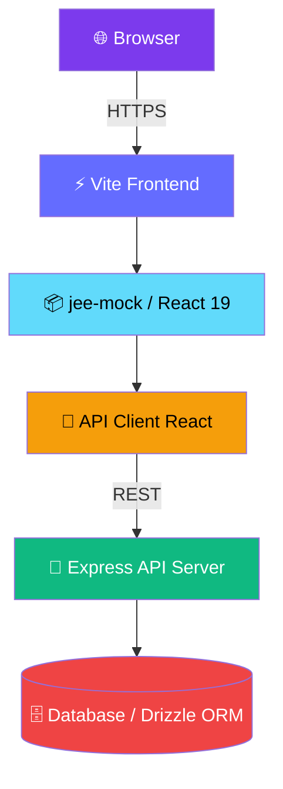

<div align="center">

<!-- Animated 3D Title Banner -->


<br/>

<!-- Animated Logo / Badge -->


<br/><br/>

<!-- Status Badges Row -->
[](https://vercel.com)
[](https://react.dev)
[](https://typescriptlang.org)
[](https://vitejs.dev)
[](https://tailwindcss.com)
[](LICENSE)

<br/>

<!-- Animated Stats Snake -->


</div>

---

<div align="center">

## 🌌 What is JEE Mock Test?

</div>

```
╔══════════════════════════════════════════════════════════════════╗
║                                                                  ║
║   JEE Mock Test is a full-stack exam simulation platform        ║
║   built for IIT-JEE aspirants. Real questions, real timer,      ║
║   real leaderboard — the closest thing to the actual exam.      ║
║                                                                  ║
╚══════════════════════════════════════════════════════════════════╝
```

<br/>

---

## ✨ Feature Matrix

<div align="center">

| Feature | Status | Description |
|--------|--------|-------------|
| 🧪 **Mock Exams** | ✅ Live | Full-length JEE simulation with real timer |
| 📊 **Analytics & Insights** | ✅ Live | Deep performance breakdown by subject |
| 🏆 **Leaderboard** | ✅ Live | Compete globally with other aspirants |
| 🔐 **Auth System** | ✅ Live | Secure login with protected routes |
| 📱 **Responsive UI** | ✅ Live | Pixel-perfect on mobile & desktop |
| 🎯 **Result Analysis** | ✅ Live | Question-level review post-exam |
| 👑 **Admin Panel** | ✅ Live | Manage tests, questions, and users |
| 🌙 **Dark Mode** | ✅ Live | Eye-friendly exam environment |

</div>

---

## 🏗️ Architecture



---

## 📂 Project Structure

```bash
web_coder_madara/
│
├── 📁 artifacts/
│   ├── 🎨 jee-mock/           # Main frontend (React + Vite)
│   │   ├── src/
│   │   │   ├── pages/         # Home, Dashboard, Exam, Result...
│   │   │   ├── components/    # Reusable UI + shadcn components
│   │   │   └── lib/           # Auth, utilities
│   │   └── vite.config.ts
│   │
│   ├── 🖥️ api-server/         # Express backend
│   │   └── src/               # Routes, middleware, controllers
│   │
│   └── 🔬 mockup-sandbox/     # Design playground
│
├── 📁 lib/
│   ├── api-client-react/      # Typed API hooks
│   ├── api-spec/              # Shared API contracts
│   ├── api-zod/               # Zod validation schemas
│   └── db/                    # Drizzle ORM schema + migrations
│
├── vercel.json                # Vercel deployment config
└── pnpm-workspace.yaml        # Monorepo workspace
```

---

## 🚀 Getting Started

### Prerequisites

```bash
node >= 18
pnpm >= 9
```

### Installation

```bash
# Clone the repository
git clone https://github.com/ragini19854-prog/web_coder_madara.git
cd web_coder_madara

# Install all dependencies
pnpm install

# Start development (frontend)
cd artifacts/jee-mock
PORT=3000 BASE_PATH=/ pnpm dev
```

### Build for Production

```bash
cd artifacts/jee-mock
pnpm build
```

---

## 🌐 Deployment

### Deploy to Vercel (One Click)

[](https://vercel.com/new/clone?repository-url=https://github.com/ragini19854-prog/web_coder_madara)

The `vercel.json` at the root auto-configures:
- ✅ Build command pointing to `jee-mock`
- ✅ SPA rewrites for React Router
- ✅ pnpm install pipeline

---

## 🛠️ Tech Stack

<div align="center">


</div>

<br/>

| Layer | Technology |
|-------|-----------|
| **Frontend** | React 19, TypeScript, Vite 7 |
| **Styling** | Tailwind CSS v4, Framer Motion, shadcn/ui |
| **State** | TanStack Query v5 |
| **Routing** | Wouter |
| **Backend** | Express.js 5 |
| **Database** | Drizzle ORM |
| **Package Manager** | pnpm (monorepo) |
| **Deploy** | Vercel |

---

## 📸 Screenshots

> Coming soon — exam interface, dashboard analytics, and leaderboard views.

---

## 🤝 Contributing

```bash
# Fork → Clone → Branch → Code → PR

git checkout -b feat/your-feature
git commit -m "feat: add amazing feature"
git push origin feat/your-feature
```

PRs are welcome! Please follow the existing code style.

---

## 📜 License

MIT © [ragini19854-prog](https://github.com/ragini19854-prog)

---

<div align="center">

<!-- Footer Wave -->


<br/>

**Built with 💜 for every JEE aspirant chasing their IIT dream**

<br/>


</div>
